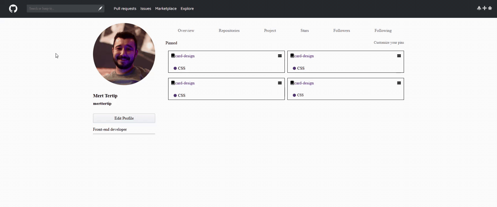

<h1>Github-Clone</h1>

    Bu proje göze hitap eden estetik Github header ve main kısmı tasarımıdır. Zarif dizaynıyla dikkatleri çekmektedir.

<h2>Projenin Özellikleri </h2>

<ul>
    <li>Açıklayıcı HTML kodlaması</li>
    <li>CSS3 Özellikleri Kullanımı</li>
    <li>SCSS Özellikleri Kullanımı</li>
</ul>

This project features an aesthetically pleasing Github header and main section design. Its elegant design attracts attention.

<h2>Project Features</h2>

<ul>
<li>Descriptive HTML coding</li>
<li>Using CSS3 Features</li>
<li>Using SCSS Features</li>
</ul>
